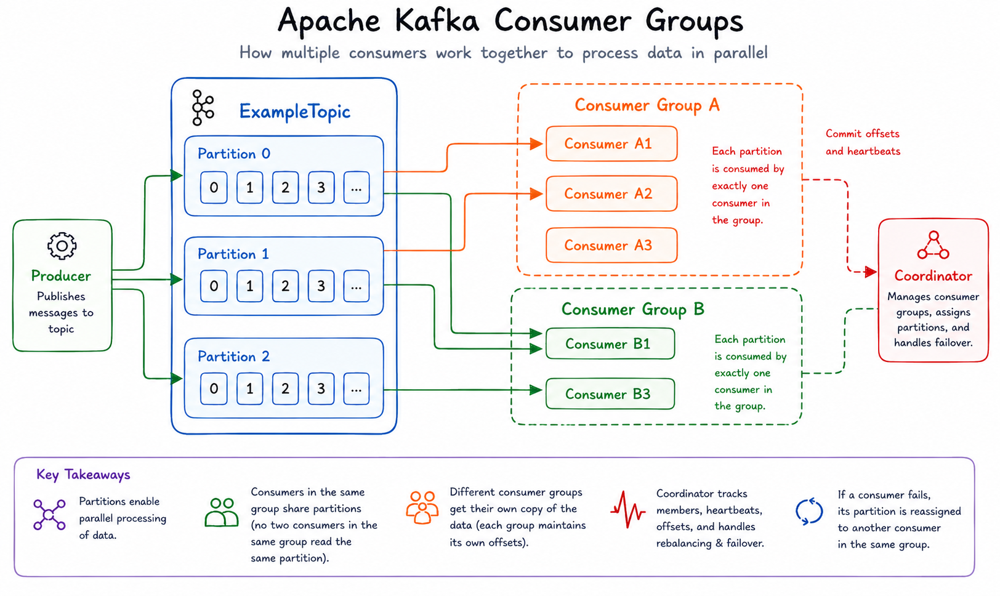
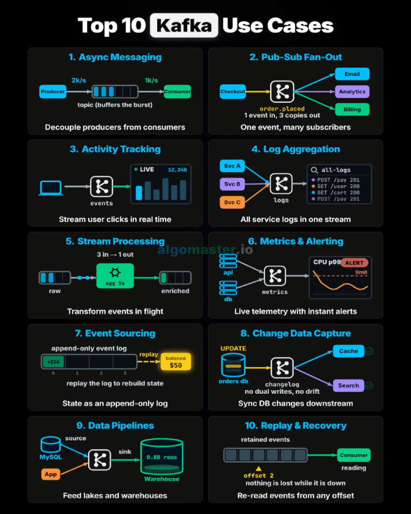

# Kafka in Practice — Real-World Use Cases

In real-world backend development, you rarely start with a task saying:

> "Implement Kafka."

Instead, you get requirements such as:

* "Send this event asynchronously without blocking the API."
* "Multiple services need to consume the same event."
* "Track what users are doing."
* "Aggregate logs from multiple services."
* "Calculate real-time metrics."
* "Keep a complete history of changes."
* "Capture database changes and publish them as events."
* "Move data from one system to another."
* "Reprocess yesterday's events after a bug fix."

At some point, you realize that many of these problems can be solved using **Kafka**.

Apache Kafka is not just a message queue. It is a **distributed event streaming platform** designed to handle high-throughput, fault-tolerant, and scalable data flows.


This repository takes you through those problems one by one.

<br>

# The Story

Imagine you have joined a company as a Backend Engineer.

The company is building a large distributed platform with multiple backend services.

Initially, the system is simple:

```text
Client
  |
  v
Backend API
  |
  v
Database
```

As the product grows, new requirements start arriving.

The engineering team doesn't want every service to directly call every other service.

Instead, they introduce an event-driven architecture:

```text
                    +----------------+
                    |   Service A    |
                    +-------+--------+
                            |
                            | Event
                            v
                     +-------------+
                     |    Kafka    |
                     +-------------+
                      /     |      \
                     /      |       \
                    v       v        v
              Service B  Service C  Service D
```

Now your Kafka journey begins.

<br>

# What Exactly Is Kafka?

At a high level, Kafka allows applications to:

1. **Produce events**
2. **Store events durably**
3. **Consume events**
4. **Process events**
5. **Replay events when necessary**

For example:

```text
Order Service
     |
     | OrderCreated
     v
   Kafka
     |
     +------> Payment Service
     |
     +------> Inventory Service
     |
     +------> Notification Service
     |
     +------> Analytics Service
```

Instead of the Order Service making four synchronous API calls, it can publish one event.

The consumers independently process that event.

<br>

# Core Kafka Concepts

Before looking at the use cases, understand these concepts.

### 1. Producer

A producer sends messages to Kafka.

```text
Application
    |
    | produce()
    v
 Kafka Topic
```

Example:

```python
producer.produce(
    "orders",
    key="order-123",
    value='{"order_id": "order-123"}'
)
```


### 2. Consumer

A consumer reads messages from Kafka.

```text
Kafka Topic
    |
    | consume()
    v
Application
```

Example:

```python
msg = consumer.poll(1.0)
```


### 3. Topic

A topic is a logical stream of events.

Examples:

```text
orders
payments
user-events
application-logs
inventory-events
```

Think of a topic as a named stream of related events.


### 4. Partition

Topics are divided into partitions.

```text
orders
 |
 +-- Partition 0
 |
 +-- Partition 1
 |
 +-- Partition 2
```

Partitions provide:

* scalability
* parallel processing
* ordering within a partition

For example:

```text
orders
 ├── P0
 ├── P1
 └── P2
```

Different consumers can process different partitions concurrently.


### 5. Offset

Every message inside a partition has an offset.

```text
Partition 0

Offset
  0  -> Order A
  1  -> Order B
  2  -> Order C
  3  -> Order D
```

Consumers track their position using offsets.

This is one of the reasons Kafka can support **replay and recovery**.


### 6. Consumer Group

A consumer group allows multiple consumers to work together.

```text
                 orders
                   |
          +--------+--------+
          |        |        |
        P0       P1       P2
          |        |        |
          v        v        v
        C1       C2       C3

             Consumer Group
```

Each partition is assigned to one consumer within a group.



This allows Kafka workloads to scale horizontally.

<br>

# Why Kafka?

Kafka becomes particularly useful when your system needs:

### High throughput

Large numbers of events can be processed continuously.

### Loose coupling

Services don't need direct knowledge of every downstream service.

### Scalability

Consumers can be added to process partitions in parallel.

### Durability

Events are persisted instead of existing only in memory.

### Replay

Consumers can read events again from earlier offsets.

### Event-driven architecture

Services can react to events asynchronously.

### Real-time processing

Applications can process streams as events arrive.


<br>

# What You Will Learn

By completing these ten demos, you will understand the practical building blocks behind Kafka-based systems:

* Producers and consumers
* Topics
* Partitions
* Offsets
* Consumer groups
* Message keys
* Ordering
* Asynchronous processing
* Pub/Sub
* Fan-out
* Event-driven architecture
* Stream processing
* Event sourcing
* CDC
* Data pipelines
* Replay
* Recovery
* Consumer scaling

You will also start seeing how these concepts combine.

For example:

```text
                +----------------+
                |   Application  |
                +-------+--------+
                        |
                        v
                     Kafka
                        |
       +----------------+----------------+
       |                |                |
       v                v                v
   Consumer A       Consumer B       Consumer C
       |                |                |
       v                v                v
   Database         Analytics        Notifications
       |
       v
   Metrics
```

This is the foundation of many modern distributed systems.

<br>

# Setup

### Requirements

* Python 3.10+
* Docker
* Docker Compose

Create a virtual environment:

```bash
python -m venv venv
```

Linux/macOS:

```bash
source venv/bin/activate
```

Windows:

```powershell
venv\Scripts\activate
```

If multiple Python versions are installed:

```powershell
py -3.10 -m venv venv
```

Install dependencies:

```bash
pip install -r requirements.txt
```

Start Kafka:

```bash
docker compose up -d
```

This starts:

* **Kafka broker** — `localhost:9092`
* **Kafka UI** — `http://localhost:8080`

The local setup uses:

```text
1 Kafka Broker
1 Controller
Replication Factor = 1
```

This is appropriate for learning and local development.

A production Kafka cluster would typically use multiple brokers and controllers for fault tolerance.

<br>

# Recommended Learning Path

Don't simply run all ten examples one after another.

For each example, ask yourself three questions:

### 1. What problem are we solving?

For example:

> "The API should not wait for notification processing."

### 2. Why Kafka?

Could this be solved with:

* a REST API?
* a database?
* Redis?
* RabbitMQ?
* a background worker?

Understanding **why Kafka is appropriate** is more important than memorizing Kafka APIs.

### 3. What happens when things fail?

Ask:

* What if the consumer crashes?
* What if Kafka goes down?
* What if a message is processed twice?
* What if processing takes too long?
* What if we add another consumer?
* What if we need to replay old events?
* What happens to ordering?
* What happens when traffic increases?

These questions move you from simply **using Kafka** to thinking like a distributed-systems engineer.

<br>

# A Practical Mental Model

Whenever you encounter a requirement involving:

```text
Many producers
      +
Large number of events
      +
Multiple consumers
      +
Asynchronous processing
      +
Need for scalability
      +
Need for durability/replay
```

Kafka should come to mind as a possible solution.

But remember:

> **Kafka is a tool, not the architecture itself.**

Good distributed-system design comes from understanding the problem first and then deciding whether Kafka is the right tool.

<br>


# Ten Patterns at a Glance

| Pattern             | Real-World Problem                             |
| -- | ------------------- |
| [`01-async-messaging`](01-async-messaging)    | Don't block the API on background work         |
| [`02-pub-sub-fan-out`](02-pub-sub-fan-out)    | Multiple services need the same event          |
| [`03-activity-tracking`](03-activity-tracking)   | Capture user/application activity              |
| [`04-log-aggregation`](04-log-aggregation)     | Centralize logs from distributed services      |
| [`05-stream-processing`](05-stream-processing)   | Process events continuously in real time       |
| [`06-metrics-alerting`](06-metrics-alerting)  | Detect conditions and trigger alerts           |
| [`07-event-sourcing`](07-event-sourcing)      | Preserve the complete history of state changes |
| [`08-change-data-capture`](08-change-data-capture) | Turn database changes into events              |
| [`09-data-pipelines`](09-data-pipelines)      | Move data between independent systems          |
| [`10-replay-recovery`](10-replay-recovery)   | Reprocess events after failures or bugs        |


<br>


# The Real Goal

After completing this repository, you shouldn't just be able to answer:

> "How do I produce a Kafka message?"

You should be able to answer:

> **"Given this distributed-system problem, should I use Kafka, how should I structure the topics and consumers, and what happens when the system scales or fails?"**

That's the real Kafka skill.

Start with **01 — Async Messaging** and gradually work your way to **10 — Replay & Recovery**.

Each folder contains its own README with the scenario, architecture, implementation, and commands required to run the demo.
